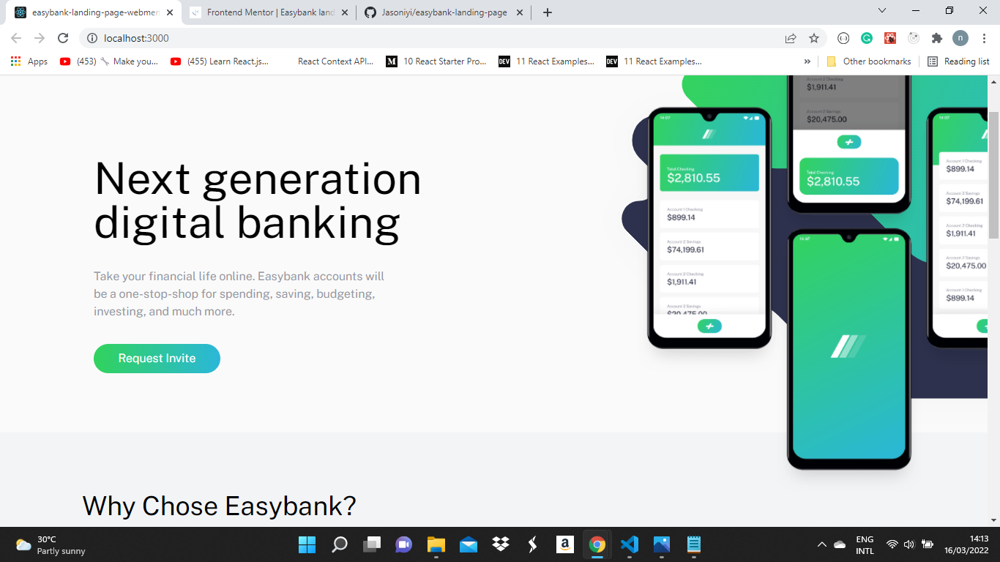

# Frontend Mentor - Easybank landing page solution

This is a solution to the [Easybank landing page challenge on Frontend Mentor](https://www.frontendmentor.io/challenges/easybank-landing-page-WaUhkoDN). Frontend Mentor challenges help you improve your coding skills by building realistic projects.

## Table of contents

- [Overview](#overview)

  - [The challenge](#the-challenge)
    Users should be able to:
    - View the optimal layout for the site depending on their device's screen size
    - See hover states for all interactive elements on the page
  - [Screenshot](#screenshot)
    
  - [Links](#links)

- [My process](#my-process)

  ### Built with

  - Javascript
  - CSS custom properties
  - Flexbox
  - HTML
  - TailwindCss

- [React](https://reactjs.org/) - JS library
- [Styled Components](https://styled-components.com/) - For styles
  - [Built with](#built-with)
  - [What I learned](#what-i-learned)
  - [Continued development](#continued-development)
  - [Useful resources](#useful-resources)
- [Author](#author)
- [Acknowledgments](#acknowledgments)
  A big thumbs up to frontend mentors for this magnificemt platform and also to
  @aphrysof for his solution, it helped me when i had a blocker.
  Thank you guys
